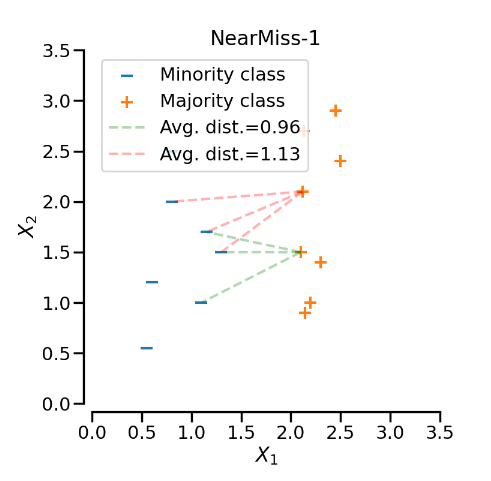
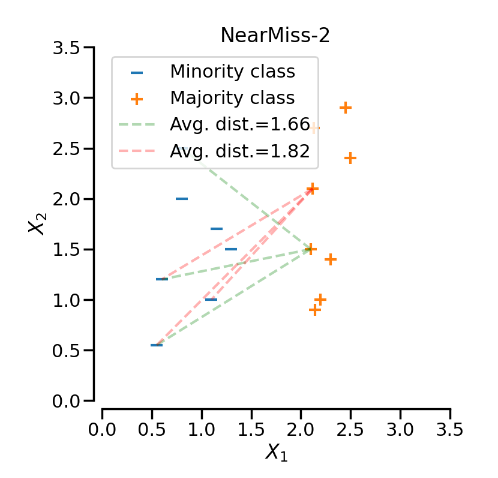
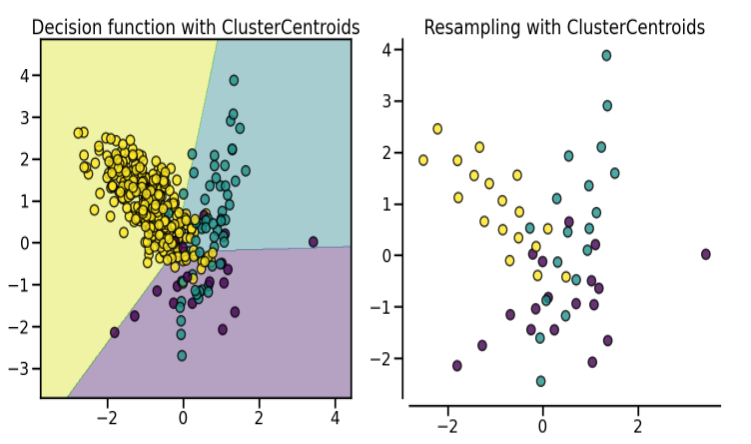
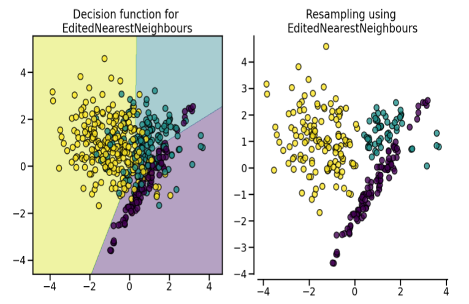
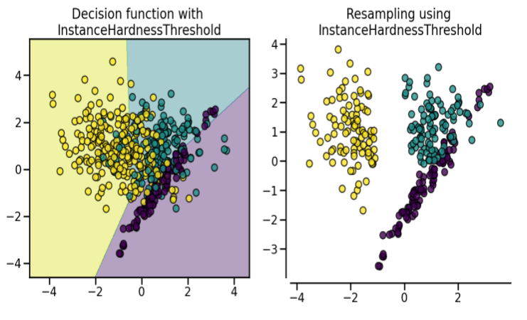
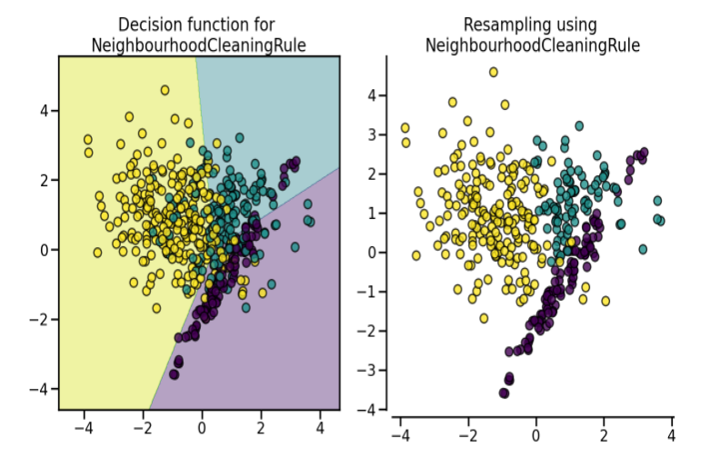

# Downsampling 

| 
NearMiss-1
 | 
NearMiss-2
 |
|-------------------------------------------|-------------------------------------------|
| 
[NearMiss-1](https://imbalanced-learn.org/stable/under_sampling.html#mathematical-formulation) selects the positive samples for which the average distance to the N closest negative class samples is the smallest.
| 
[NearMiss-2](https://imbalanced-learn.org/stable/under_sampling.html#mathematical-formulation) selects the positive samples for which the average distance to the N farthest negative class samples is the smallest.
 |

  
   

| 
ClusterCentroids
 | 
Edited Nearest Neighbors
 |
|-------------------------------------------|-------------------------------------------|
| 
[The approach](https://imbalanced-learn.org/stable/under_sampling.html#cluster-centroids) makes use of K-means to reduce the number of samples. Therefore, each class will be synthesized with the centroids of the K-means method instead of the original samples
 | 
[The approach](https://imbalanced-learn.org/stable/under_sampling.html#edited-nearest-neighbors) applies a nearest-neighbours algorithm and “edits” the dataset by removing samples which do not agree “enough” with their neighbourhood
 |

  
   

| 
Instance Hardness Threshold
 | 
Neighborhood Cleaning Rule
 |
|-------------------------------------------|-------------------------------------------|
| 
[This approach](https://imbalanced-learn.org/stable/under_sampling.html#instance-hardness-threshold) is a specific algorithm in which a classifier is trained on the data and the samples with lower probabilities are removed
 | 
[This approach](https://imbalanced-learn.org/stable/under_sampling.html#condensed-nearest-neighbors-and-derived-algorithms) is sensitive to noisy data ⚠️ It focuses on cleaning the data than condensing them. Therefore, it will use the **union** of samples to be rejected between the ENN algorithms and the output of a 3 nearest neighbours classifier.
 |

  
   

